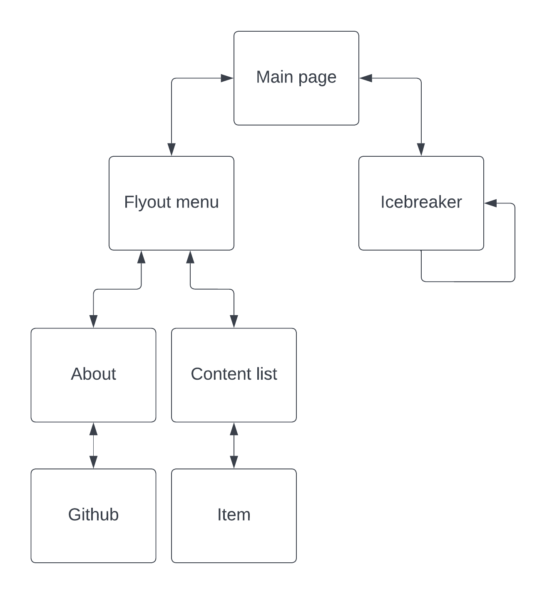

# APPLICATION PROJECT IN EITG01

**Application named Titanic, Created and devoloped by Isac Karlsson and Nils Ahlmén (IEA20).**     
 
- The project is a compulsory part of the course EITG01 - Computer and Telecommunication 2022.      
- The application is devoloped in Visual Studio 2019, used code language are C# (C sharp), for page and visual management Xamarin is used.

**See Flowchart for the applications structure.**

