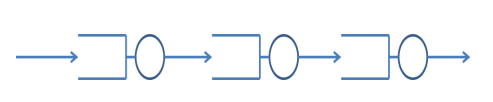
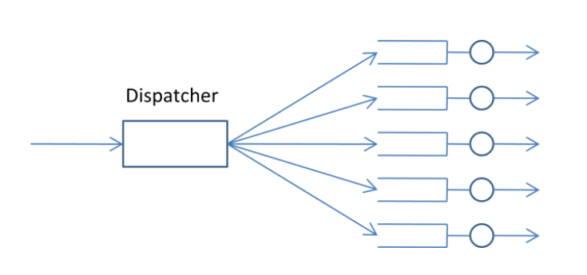

Laboration 2 - EITG01 - Dator och Telekommunikation 
=
a) 
-
**Hur många betjänare har kösystemen som definieras av klassen QS?**   

**Svar:** 1, en betjänare.

#
b)
-
**Hur många buffertplatser finns det i en QS?**
    
**Svar:** Int "max"
#   
c)
-
**Är betjäningstiden slumpmässig eller konstant? Hur lång är betjäningstiden i medeltal? Hur stor är en betjäningsintensiteten?**

**Svar:** Betjäningstiden är Slumpmässig.
Betjäningstiden i medeltal är: $\overline{x}=1/\mu = 0,1 $
    
Betjäningsintensiteten är $\mu$ = $1 / ([0 $ $ 0,2] /2) = 1 / 0,1 = 10$
#
d) 
-
**Till vad används attributet sendTo i klasserna?**
     
**Svar:** Anger till vilken process de genererade kunderna ska skickas.
#   
e)
-
**Simulera ett system som ser ut på följande sätt:**

     
Låt ankomstintensiteten till den första kön vara 8 per sekund.   
Ändra inte medelbetjäningstiderna som finns i klassen QS? 
            
Vad blir medelantal kunder i var och en av kösystemen? 
    
*Denna uppgift kan göras genom att bara ändra i MainSimulation.java.*

**Svar:**   
- **Medelantal kunder i kösystem 1:** $1,7811420929721962$  
- **Medelantal kunder i kösystem 2:** $1,728043597820109$   
- **Medelantal kunder i kösystem 3:** $1,6973646017876267$

#
f)
-
**Vi ska studera lastdelning, vilket används i många sammanhang, t.ex. webbservers, datanät
och inom logistik.**    

**Det finns ett antal kösystem och en fördelare som helt enkelt ska fördela jobb mellan köerna.  
Fördelaren väljer vilket kösystem som en ankommande kund ska skickas till.**  

***Se figuren:***     

  
*Dispatchern kan använda någon av följande algoritmer för att bestämma till vilket kösystem 
som den ska skicka ett nytt jobb:*

# i.

**Väljer ett kösystem på slump.    
Svar:**
- **Medelantal kunder i kösystem 1:** $5,711491589083789$       
- **Medelantal kunder i kösystem 2:** $5,677147697827387$   
- **Medelantal kunder i kösystem 3:** $5,687687867621359$   
- **Medelantal kunder i kösystem 4:** $5,668116985736862$   
- **Medelantal kunder i kösystem 5:** $5,658615620030604$ 

# ii. 
 
**Den väljer system1, sedan 2, sedan 3, sedan 4, sedan5, sedan 1 igen osv.  
Svar:**   
- **Medelantal kunder i kösystem 1:** $2,286747277146029$   
- **Medelantal kunder i kösystem 2:** $2,299653417741806$   
- **Medelantal kunder i kösystem 3:** $2,3022303598555345$  
- **Medelantal kunder i kösystem 4:** $2,277299628849433$  
- **Medelantal kunder i kösystem 5:** $2,311140612678798$  
       
# iii.

**Den väljer systemet med minst antal jobb (om fler system har minst antal jobb så bryr vi oss inte om vilket som väljs).    
Vi antar att dispatchern alltid kommer åt antalet kunder i kösystemen.**

Svar:    
- **Medelantal kunder i kösystem 1:** $1,8815605388335932$ 
- **Medelantal kunder i kösystem 2:** $1,6781820897008313$
- **Medelantal kunder i kösystem 3:** $1,486032459425718$
- **Medelantal kunder i kösystem 4:** $1,3033919346441873$  
- **Medelantal kunder i kösystem 5:** $1,129163840906371$   

***Simulera systemet och avgör vilken algoritm som ger det minsta totala antalet kunder i alla kösystemen.***    
***Ändra inte medelbetjäningstiderna i kösystemen och låt ankomstintensiteten till dispatchern vara 45 per sekund.***